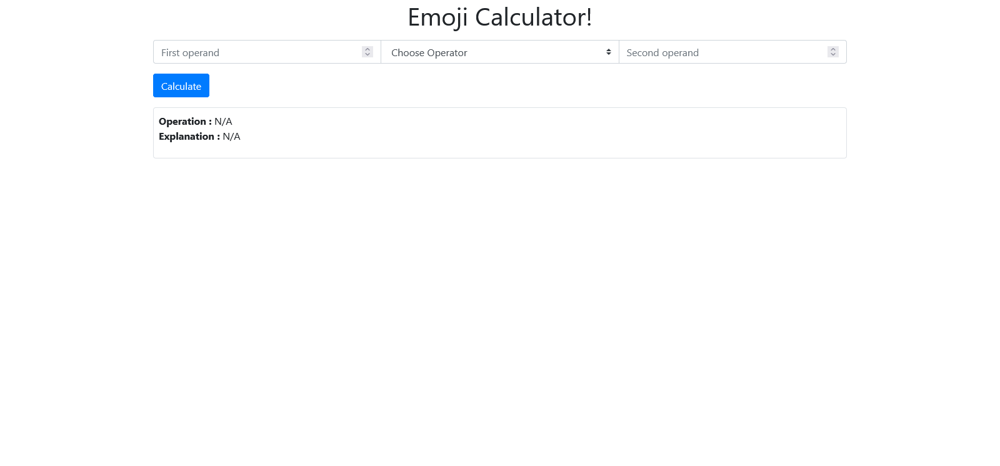

# Emoji Calculator

## Installation
- Git clone the project repository from this link: [hafiz](http://google.com)
- Execute this  command to install composer dependence
```bash
composer install
```
- Create an application Encryption Key using this command
```bash
php artisan key:generate
```
- To start the application run this command
```bash
php artisan serve --port=5004
```
- Click on this link: [Emoji Calculator](http://127.0.0.1:5004) to open application

## Manual
When you see web page is loaded on web browser. please follow this instruction to operate this application.
- Type first operand as number value only you can use positive number.
- Select operator emoji icon from this available options
    1. 👽 Addition (Alien)
    2. 💀 Subtraction (Skull)
    3. 👻 Multiplication (Ghost)
    4. 😱 Division (Scream)
- Type second operand as number value only you can use positive number.
- Click the "Calculate" button to get result
System replay will have Operation to confirm which operation program 
  detected and Operation explanation in human format.

## Interface

