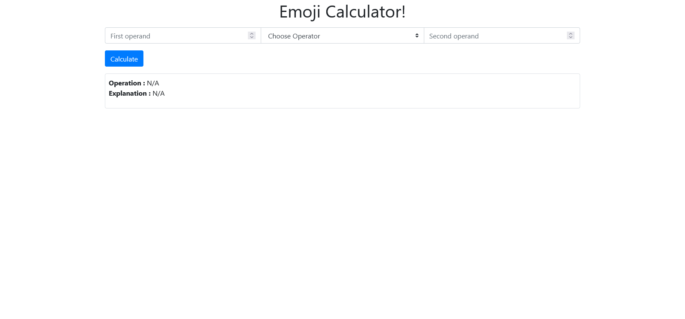

# Emoji Calculator

## Installation
- Git clone the project repository from this link: [Emoji Calculator](https://github.com/mah-shamim/emoji-calculator.git)

# How to install

Run this command to clone
```bash
    git clone https://github.com/mah-shamim/emoji-calculator.git
```

Go to emoji-calculator folder
```bash
    cd emoji-calculator
```

Pull the docker image
```bash
    docker pull mahshamim/laraedit:8.1
```
Run the container
```bash
    docker run -tid -p 3000:80 -p 3001:3306 -p 3002:22 --name emoji-calculator -d -v  /path/to/your/app:/var/www/html/app mahshamim/laraedit:8.1
```

- Execute this  command to install composer dependence
```bash
cd var/www/html/app/

composer install --ignore-platfrom-reqs
```

- Click on this link: [Emoji Calculator](http://127.0.0.1:5004) to open application

## Unit Test
- To unit test the application
```bash
php artisan test
```

## Manual
When you see web page is loaded on web browser. please follow this instruction to operate this application.
- Type first operand as number value only you can use any number.
- Select operator emoji icon from this available options
    1. 👽 Addition (Alien)
    2. 💀 Subtraction (Skull)
    3. 👻 Multiplication (Ghost)
    4. 😱 Division (Scream)
- Type second operand as number value only you can use any number.
- Click the "Calculate" button to get result
  System replay will have Operation to confirm which operation program
  detected and Operation explanation in human format.

## Interface

